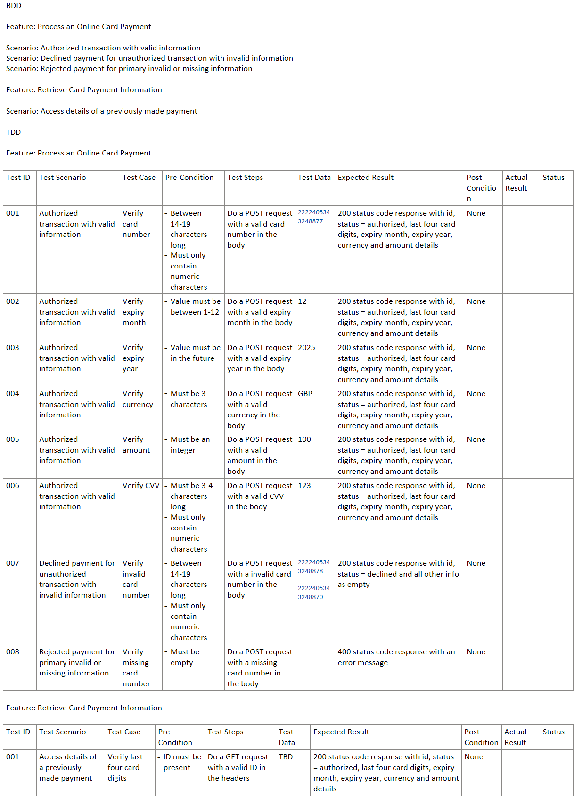

# Instructions for candidates

This is the Java version of the Payment Gateway challenge. If you haven't already read this [README.md](https://github.com/cko-recruitment/) on the details of this exercise, please do so now.

## Requirements
- JDK 17
- Docker

## Template structure

src/ - A skeleton SpringBoot Application

test/ - Some simple JUnit tests

imposters/ - contains the bank simulator configuration. Don't change this

.editorconfig - don't change this. It ensures a consistent set of rules for submissions when reformatting code

docker-compose.yml - configures the bank simulator

## API Documentation
For documentation openAPI is included, and it can be found under the following url: **http://localhost:8090/swagger-ui/index.html**

**Feel free to change the structure of the solution, use a different library etc.**

## Design and decisions made
I tried to keep everything as simple and clean as possible, like Clean Code and SOLID suggest, and tried to follow Hateoas principles for API Design.
I used some frameworks like Java Bean Validation (to validate attributes) and MapStruct (to parse one class to another).
Also, below there are some tests I designed before having started coding, however I did not implemented all of them.

